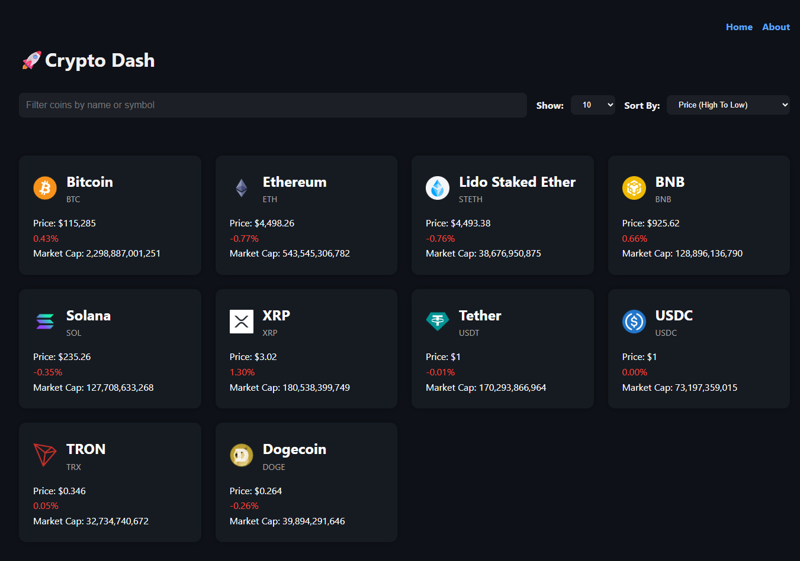

# 💹 CryptoDash – Cryptocurrency Dashboard

A React + Vite application that fetches live cryptocurrency data from the **CoinGecko API** and displays it in a clean, interactive dashboard. This App was built as part of a Brad Traversy React course.

The app features **React Router** for navigation, **Chart.js** for data visualization, and multiple tools for filtering and sorting cryptocurrency data.

---

## 🚀 Features

- Fetch live crypto data from the **CoinGecko API**
- View **current price, market cap, and 24h price change** for each coin
- Sort coins by price, market cap, or 24h change
- Filter/search for coins by name or symbol
- Select number of coins to display per page (5, 10, 20, 50, 100)
- **Coin details page** with a **Chart.js graph**
- About page with project details
- Responsive and modern UI

---

## 🛠️ Technologies Used

- **React (Hooks & Functional Components)**
- **Vite** (project setup & bundler)
- **React Router (Declarative Routing)**
- **Chart.js** (data visualization)
- **CoinGecko API**
- **CSS / Custom styling**

---

## 📷 Screenshot



---

## ⚙️ Installation & Setup

Clone the repo:

```bash
git clone https://github.com/your-username/crypto-dash.git
cd cryptodash
```
